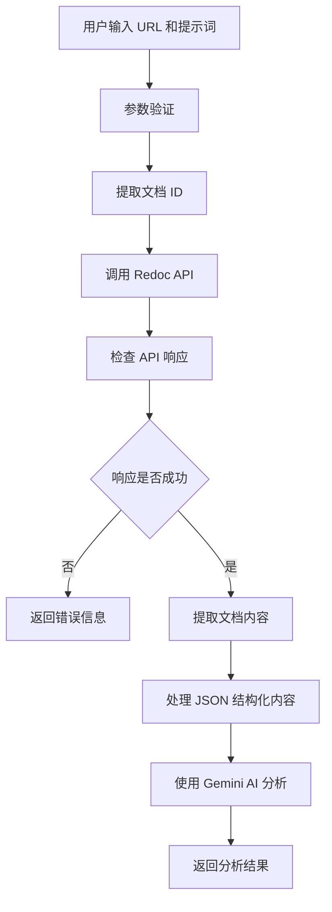

# RedocFetch 工具技术文档

## 概述

RedocFetch 是一个专门用于获取小红书 Redoc 文档内容的工具。当用户输入特定格式的文档 URL 时，工具会自动调用内部 API 获取文档内容，并使用 AI 模型进行处理和分析。

## 功能特性

- **自动 URL 识别**: 自动识别 `https://docs.xiaohongshu.com/doc/{doc_id}` 格式的 URL
- **API 集成**: 调用内部 Redoc API 获取文档内容
- **AI 处理**: 使用 Gemini 模型分析和处理文档内容
- **错误处理**: 完善的错误处理和日志记录
- **参数验证**: 严格的输入参数验证

## API 规范

### 输入参数

```typescript
interface RedocFetchToolParams {
  url: string;    // Redoc 文档 URL，格式：https://docs.xiaohongshu.com/doc/{doc_id}
  prompt: string; // 用于处理获取内容的提示词
}
```

### URL 格式要求

- **支持格式**: `https://docs.xiaohongshu.com/doc/{doc_id}`
- **文档 ID**: 32 位十六进制字符串（如：`fefc99fb9aaa0bf065432cf88cd42431`）
- **示例**: `https://docs.xiaohongshu.com/doc/fefc99fb9aaa0bf065432cf88cd42431`

### 内部 API 调用

**请求地址**: `https://athena-next.devops.beta.xiaohongshu.com/api/media/query/redoc`

**请求方法**: POST

**请求体**:
```json
{
  "doc_id": "fefc99fb9aaa0bf065432cf88cd42431"
}
```

**响应格式**:
```json
{
  "code": 0,
  "success": true,
  "msg": "成功",
  "data": {
    "title": "文档标题",
    "content": "{\"children\":[...]}" // JSON 字符串格式的文档内容
  }
}
```

## 实现架构

### 核心类

```typescript
export class RedocFetchTool extends BaseDeclarativeTool<RedocFetchToolParams, ToolResult>
```

### 主要方法

1. **validateToolParamValues**: 验证输入参数
2. **extractDocIdFromUrl**: 从 URL 提取文档 ID
3. **fetchRedocContent**: 调用 API 获取文档内容
4. **execute**: 执行完整的工具流程

## 工作流程



## 错误处理

### 参数验证错误

- 空 URL: `'url' 参数不能为空。`
- 无效格式: `'url' 必须是有效的 Redoc URL，格式为：https://docs.xiaohongshu.com/doc/{doc_id}`
- 空提示词: `'prompt' 参数不能为空。`

### API 调用错误

- HTTP 错误: `Redoc API request failed with status code {status} {statusText}`
- 业务错误: `Redoc API returned error (code: {code}): {message}`
- 内容缺失: `Redoc API response does not contain content field in data`

### 网络错误

- 通用网络错误会被捕获并返回详细的错误信息

## 调试功能

工具内置了详细的调试日志：

```typescript
console.debug(`[RedocFetchTool] API 响应详情:`, {
  success: responseData.success,
  code: responseData.code,
  message: responseData.msg,
  title: responseData.data?.title,
  contentLength: responseData.data?.content?.length || 0
});
```

## 集成方式

### 工具注册

在 `packages/core/src/config/config.ts` 中注册：

```typescript
import { RedocFetchTool } from '../tools/redoc-fetch.js';

// 在工具注册部分添加
registerCoreTool(RedocFetchTool, this);
```

### 使用示例

```typescript
const tool = new RedocFetchTool(config);
const result = await tool.execute({
  url: 'https://docs.xiaohongshu.com/doc/fefc99fb9aaa0bf065432cf88cd42431',
  prompt: '总结这个文档的主要内容'
});
```

## 测试策略

### 单元测试

- 基本属性验证
- URL 格式验证
- 参数验证逻辑

### 集成测试建议

由于工具依赖外部 API，建议的测试方式：

1. **手动测试**: 在开发环境中使用真实 URL 测试
2. **API 验证**: 使用 Postman/Apifox 验证 API 响应格式
3. **端到端测试**: 在 CI/CD 中使用测试文档进行完整流程测试

## 注意事项

1. **API 依赖**: 工具依赖内部 API，需要确保网络连接和 API 可用性
2. **文档格式**: 支持 JSON 结构化文档内容的智能解析
3. **性能考虑**: 大文档可能影响处理速度
4. **错误恢复**: 遇到错误时会提供详细的错误信息用于调试

## 版本历史

- **v1.0.0**: 初始版本，支持基本的 Redoc 文档获取和 AI 处理
- **v1.1.0**: 修复 API 响应格式匹配问题，优化错误处理
- **v1.2.0**: 简化测试结构，增强调试功能

## 相关文件

- 主要实现: `packages/core/src/tools/redoc-fetch.ts`
- 测试文件: `packages/core/src/tools/redoc-fetch.test.ts`
- 配置注册: `packages/core/src/config/config.ts` 